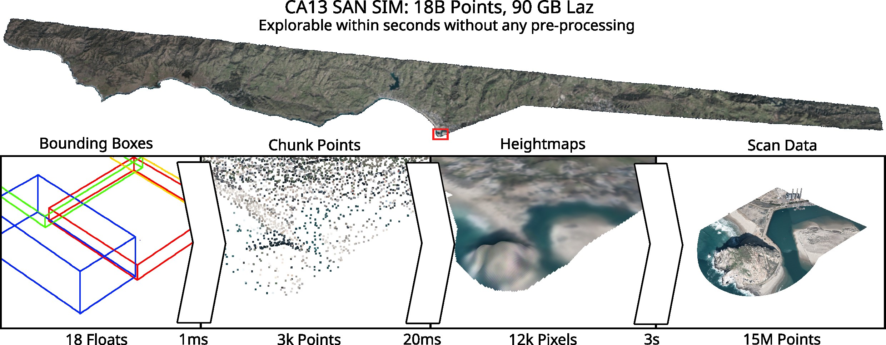

# LidarScout 
Direct Out-of-Core Rendering of Massive Point Clouds

This is the official implementation of LidarScout (High-Performance Graphics 2025). See the paper and other data here: https://www.cg.tuwien.ac.at/research/publications/2025/erler-2025-lidarscout/

This is the repository for training and evaluating the model. For the viewer and an executable, see https://github.com/cg-tuwien/lidarscout




## Setup

We tested this repository on Windows 10/11 with CUDA 12.4 and Python 3.12. We recommend installing the dependencies with venv and Pip.

``` bash
# clone this repo
git clone git@github.com:cg-tuwien/lidarscout_training.git

# go into the cloned dir
cd lidarscout_training

1. Create the virtual environment with: `python -m venv .venv`
2. Activate the virtual environment in a terminal with a matching script in `.venv\Scripts\`
   1. Windows Powershell: [Enable script execution via PS with admin rights](https://learn.microsoft.com/en-us/powershell/module/microsoft.powershell.core/about/about_execution_policies?view=powershell-7.5): `Set-ExecutionPolicy -ExecutionPolicy RemoteSigned -Scope CurrentUser`. Then activate the virtual environment in a normal terminal with `.venv\Scripts\Activate.ps1`.
   2. Windows CMD: Run `.venv\Scripts\activate.bat`
   3. Linux: Run `.venv\Scripts\activate`
3. Install all necessary dependencies with: `pip install -r requirements.txt`
```


## Datasets, Model and Results

Datasets for training (extract to have the `bins` folder and several text files in `[repo_root]/datasets/laz_minimal/`): https://users.cg.tuwien.ac.at/perler/lidarscout/laz_minimal.zip

Models for evaluation (extract to have e.g. `ipes_cnn` in `[repo_root]/models`): https://users.cg.tuwien.ac.at/perler/lidarscout/models.zip

Results (extract to `[repo_root]/results`):
- (main) https://users.cg.tuwien.ac.at/perler/lidarscout/results/ipes_cnn_rgb.zip
- (main without color) https://users.cg.tuwien.ac.at/perler/lidarscout/results/ipes_cnn.zip
- (best with extra training data) https://users.cg.tuwien.ac.at/perler/lidarscout/results/ipes_cnn_allstar.zip
- https://users.cg.tuwien.ac.at/perler/lidarscout/results/ipes_cnn_colorizer.zip
- https://users.cg.tuwien.ac.at/perler/lidarscout/results/ipes_cnn_only_lin.zip
- https://users.cg.tuwien.ac.at/perler/lidarscout/results/ipes_cnn_only_nn.zip
- https://users.cg.tuwien.ac.at/perler/lidarscout/results/ipes_interp_cubic.zip
- https://users.cg.tuwien.ac.at/perler/lidarscout/results/ipes_interp_linear.zip
- https://users.cg.tuwien.ac.at/perler/lidarscout/results/ipes_interp_nearest.zip
- https://users.cg.tuwien.ac.at/perler/lidarscout/results/ipes_rast.zip
- https://users.cg.tuwien.ac.at/perler/lidarscout/results/ipes_unet.zip


## Create your own datasets

1. WARNING: These tools are not exactly clean and robust. Open an issue if you run into problems.
2. Find a nice scan in LAS or LAZ format. There are public repositories like [Opentopography](https://portal.opentopography.org/datasetMetadata?otCollectionID=OT.032013.26910.2).
3. Follow the instructions in `[repo_root]/datasets/tools/00_readme.md`
4. Create new dataset splits or add yours to the textfiles in `[repo_root]/datasets/laz_minimal/`.


## Run the Training, Reconstruction and Evaluation

Make sure, you have activated the virtual environment as described above. Now, you can run the training, reconstruction and evaluation simply with 
``` bash
python ipes.py
```

Training takes about 30-45 minutes on a NVIDIA RTX 3090. The first epoch will take longer since we need to create the image cache from the point sub-samples.

Logging during training with Tensorboard is enabled by default. You can start a Tensorboard server with: 
``` bash
tensorboard --logdir models
```

To run other model variants for ablation and comparison, modify the parameters in the YAML configs in `[repo_root]/configs` or override then in `ipes.py` and `ipes_interp.py`. Run those again for a train, reconstruct, evaluate cycle:
``` bash
python ipes.py         # learned
python ipes_interp.py  # un-learned, skips training
```

You can gather all the evaluation statistics from the XLSX files for easy copy&paste by running
``` bash
python gather_table_data.py
```

At the end of the training, the model will be traced, creating a TorchScript model. This file is stored in `[repo_root]/models` as `.pt`. You can transfer this to the [LidarScout viewer](https://github.com/cg-tuwien/lidarscout). See the [`heightmap_interp` sub-project](https://github.com/cg-tuwien/lidarscout/tree/main/heightmap_interp) for the usage in LibTorch.


## Folder and File Structure

### Training Set

The `heightmaps.bin` files contain heightmap training samples. One record corresponds to a position in the point cloud, together with its ground-truth heightmap. The position is stored as a 3D vector of doubles, the heightmap as 64x64 floats. So every record consists of 3*8 B + 64*64*4 B = 24 + 16,384 B = 16,408 B. Read this number of bytes until the end of the file to extract all 1000 records. The heights are in meters above sea level.
This data can be extracted with NumPy (please see usage example in ipes_data_loader.py):
```
import numpy as np
hm_size = 64
dt = np.dtype('3f8, ({},{})f4'.format(hm_size, hm_size))
hm_data = np.fromfile(file=hm_file, dtype=dt)
query_pts = hm_data['f0']
hm = hm_data['f1']
```

`rgb_0.bin`, `rgb_1.bin`, `rgb_2.bin` have exactly the same structure as the `heightmaps.bin`, but instead of heights, they contain color data. `rgb_0.bin` contains the red channel, `rgb_1.bin` contains the green channel, and `rgb_2.bin` contains the blue channel. The colors are floats in the range of 0..255.

### Testing Outputs
`results/laz_minimal` contains predictions and analysis for testing datasets with GT data. These correspond to the testing stage of the training. There, each dataset has an XLSX file containing the metrics for each batch of samples. The `test` sub-folder contains the predictions and GT of each batch in the form of figure PNGs of the textured heightmaps and point cloud PLYs in model space of the input point cloud. Please see ipes_base.py for more details.

### Prediction Outputs
Each dataset has a sub-folder in `results`, in which are:
- `*.npy`: predicted heightmap values as (b, n, 64, 64) NumPy float arrays as meters above sea level. b ist the number of batches, n the number of predicted tiles per batch.
- `*_rgb.npy`: predicted RGB color values as (b, n, 64, 64, 3) NumPy float arrays in the range of 0..1. 
- `*_xy.npy`: tile center coordinates of the predictions as (b, n, 2) NumPy float arrays in the range of the input point cloud's bounding box. We store only X and Y as the height is always 0. Since empty tiles are omitted, we need to explicitly store the predicted tile coordinates for registration in the input coordinate system.
- `*.ply`: 3D representations of the predicted heightmaps as one point cloud.
Please see ipes_base.py for more details.


## Trouble Shooting

On Windows, Pip install may raise a 
"Microsoft Visual C++ 14.0 or greater is required. 
Get it with "Microsoft C++ Build Tools" error. 
In this case, install the MS Visual Studio build tools, 
as described on [Stackoverflow](https://stackoverflow.com/questions/64261546/how-to-solve-error-microsoft-visual-c-14-0-or-greater-is-required-when-inst).


## Citation
If you use our work, please cite our paper:
```
@inproceedings{erler2025lidarscout,
  booktitle = {High-Performance Graphics - Symposium Papers},
  editor = {Knoll, Aaron and Peters, Christoph},
  title = {{LidarScout: Direct Out-of-Core Rendering of Massive Point Clouds}},
  author = {Erler, Philipp and Herzberger, Lukas and Wimmer, Michael and Schütz, Markus},
  year = {2025},
  publisher = {The Eurographics Association},
  ISSN = {2079-8687},
  ISBN = {978-3-03868-291-2},
  DOI = {10.2312/hpg.20251170}
}
```
